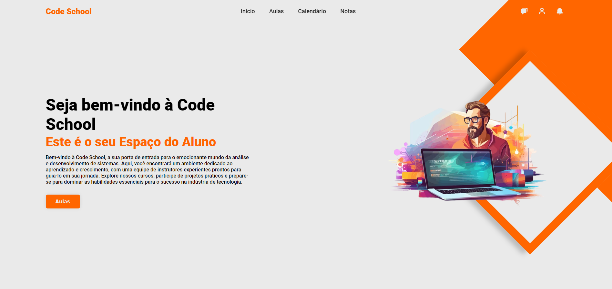

## Projeto Sistema Acadêmico - Code School🏫

O Sistema Acadêmico é uma plataforma web abrangente que simplifica a gestão acadêmica para alunos e professores. Com funcionalidades que vão desde visualização de aulas até inclusão de notas, o sistema proporciona uma experiência intuitiva e eficaz.

### Funcionalidades Principais
### Alunos:

- Visualize a lista completa de aulas disponíveis, juntamente com informações detalhadas.
- Acompanhe o progresso acadêmico com acesso rápido às notas e desempenho individual.
- Mantenha-se atualizado com um calendário de atividades intuitivo.
### Professores:

- Inclua e atualize as notas dos alunos de forma simples e eficiente.
- Acesse um histórico completo das aulas ministradas para melhor acompanhamento do progresso da turma.
- Utilize o calendário integrado para programar atividades e avaliações.
  
## Tecnologias Utilizadas🖥️
O Sistema Acadêmico foi desenvolvido utilizando as seguintes tecnologias:

IDE: Spring Tool Suite 4 para facilitar o desenvolvimento e a gestão do projeto.

Linguagens:

Java: Utilizado para a lógica de programação e funcionalidades do sistema.
HTML e CSS: Responsáveis pela construção da interface do usuário, garantindo uma experiência amigável e intuitiva.
Para rodar o projeto em seu ambiente local, siga os passos abaixo:

### Pré-requisitos:

Certifique-se de ter o Spring Tool Suite 4 instalado em seu ambiente de desenvolvimento.
Clonando o Repositório:

bash
Copy code
git clone https://github.com/seu-usuario/sistema-academico.git
Configuração:

Abra o projeto no Spring Tool Suite 4 e ajuste as configurações conforme necessário.
Executando:

Inicie o servidor e acesse a aplicação através do navegador no endereço http://localhost:8080.
Resultados e Conclusão
O Sistema Acadêmico demonstrou ser uma ferramenta valiosa para a gestão educacional, proporcionando uma experiência mais transparente e eficaz tanto para alunos quanto para professores. O feedback positivo recebido destaca a facilidade de uso e a precisão nas informações apresentadas.

### Contribuições📍
Ficaríamos felizes em receber contribuições da comunidade! Se deseja colaborar, siga os passos abaixo:

Faça um fork do repositório.
Crie uma nova branch para a sua contribuição.
Desenvolva e teste suas alterações.
Submeta um pull request para revisão.

##  Contato ☎️

E-mail: contatocaioguimaraess@gmail.com
